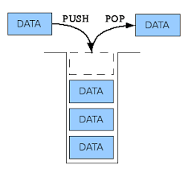

Prepare-TypeC
===============


### 1. 자료구조
#### 1-1. Stack
> 먼저 들어간 데이터가 나중에 나오는 자료구조
> 1. 장점  
>	 - 구현이 쉽다.  
>	 - 원하는 데이터의 접근 속도가 빠르다. ex) arr[2]를 사용하여 3번째 데이터에 바로 접근 가능  
>	 - 최근 생성된 데이터 순으로 처리할 때 좋다.  
> 1. 단점  
>	 - 데이터의 최대 개수를 미리 정해야 한다.  
>	 - 데이터의 삽입과 삭제에 있어서 비효율적이다.  

|  |
|:---------:|

##### 예시코드
```c++
class Stack {	
private:
	int top;
	int size;
	int arr[40];

public :
	Stack() {
		top = 0;
		size = 40;

	}

	void push(int c) {
		
		if (top < size) {
			arr[top++] = int(c);
		}
	}

	int pop() {
		int val = -1;
		if (!isEmpty()) {
			val = arr[--top];
		}
		return val;
	}

	bool isEmpty() {
		return top == 0;
	}
};

```

#### 1-2. Queue  
> 먼저 들어간 데이터가 먼저 나오는 구조
> 1. 장점  
>	 - 데이터가 입력된 시간 순서대로 처리해야 할 필요가 있는 상황에 유리하다. 
> 1. 단점  
>	 - 크기가 제한적이다.
>	 - 큐의 앞 부분이 비어도 데이터를 삽입할 수 없다. => 메모리 낭비, 관리의 어려움
>	 - 큐가 Empty여도 Not Empty라 판단할 수 있다. => 추가적인 조치사항이 필요하다. 구현의 어려움


-------------------------

# 마지막으로..


|  |
|:---------:|


> 나무를 베는데 한 시간이 주어진다면, 도끼를 가는데 45분을 쓰겠다.


> *난이도가 올라갈수록 문제를 바로 푸는 것보다 어떻게 풀 것인지를 오래 고민하자*


