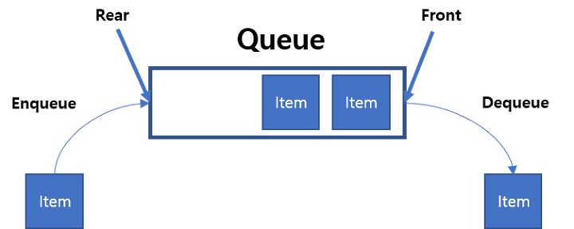
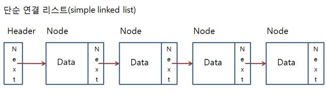
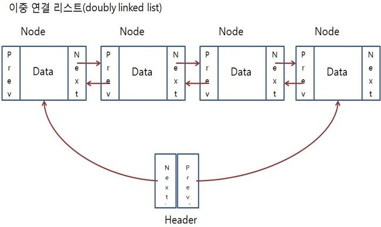

Prepare-TypeC
===============


### 1. 자료구조
#### 1-1. Stack
> 먼저 들어간 데이터가 나중에 나오는 자료구조
> 1. 장점  
>	 - 구현이 쉽다.  
>	 - 원하는 데이터의 접근 속도가 빠르다. ex) arr[2]를 사용하여 3번째 데이터에 바로 접근 가능  
>	 - 최근 생성된 데이터 순으로 처리할 때 좋다.  
> 1. 단점  
>	 - 데이터의 최대 개수를 미리 정해야 한다.  
>	 - 데이터의 삽입과 삭제에 있어서 비효율적이다.  
> 1. 추천 알고리즘 문제
>	 - https://www.acmicpc.net/problem/2504  괄호의 값

|  |
|:---------:|

##### 예시코드
```c++
class Stack {	
private:
	int top;
	int size;
	int arr[40];

public :
	Stack() {
		top = 0;
		size = 40;

	}

	void push(int c) {
		
		if (top < size) {
			arr[top++] = int(c);
		}
	}

	int pop() {
		int val = -1;
		if (!isEmpty()) {
			val = arr[--top];
		}
		return val;
	}

	bool isEmpty() {
		return top == 0;
	}
};

```

--------------------

#### 1-2. Queue  
> 먼저 들어간 데이터가 먼저 나오는 구조
> 1. 장점  
>	 - 데이터가 입력된 시간 순서대로 처리해야 할 필요가 있는 상황에 유리하다. 
> 1. 단점  
>	 - 크기가 제한적이다.
>	 - 큐의 앞 부분이 비어도 데이터를 삽입할 수 없다. => 메모리 낭비, 관리의 어려움
>	 - 큐가 Empty여도 Not Empty라 판단할 수 있다. => 추가적인 조치사항이 필요하다. 구현의 어려움
> 1. 추천 알고리즘 문제
>	 - https://www.acmicpc.net/problem/2905  홍준이와 울타리  

|  |
|:---------:|

##### 예시코드
```c++
class Queue {
private:
	int front;
	int rear;
	int arr[100000];
	int size;

public:
	Queue() {
		size = 100000;
		front = 0;
		rear = 1;
	}
	bool isEmpty() {
		return ((size + rear) - front) % size == 1;
	}
	bool isFull() {
		return front == rear;
	}
	void add(int i) {
		if (!isFull()) {
			arr[rear] = i;
			rear = (rear + 1) % size;
		}
	}
	int remove() {
		int value = -11111111;
		if (!isEmpty()) {
			front = (front + 1) % size;
			value = arr[front];
		}
		return value;
	}
	int peek() {
		int value = -11111111;
		if (!isEmpty()) {
			value = arr[(front + 1) % size];
		}
		return value;
	}
};

```
--------------------

#### 1-3. Linked List
> 리스트의 자료를 순차적으로 정리해 놓은 것을 말한다. 
> 1. 장점  
>	 - 자료가 입력 될 때마다 동적할당으로 새로운 메모리를 할당하므로 메모리 관리 용이 
>	 - 삽입과 삭제에 대한 오버헤드가 적다.  
>	 - 대부분의 상황에서 배열보다 삽입과 삭제가 빠르다.  
> 1. 단점  
>	 - 포인터 부분을 모든 데이터마다 가지고 있어야 해서 같은 크기의 배열보다 메모리 낭비가 있다.
>	 - 원하는 데이터의 검색이 느리다.
>	 - 구현의 어려움. 
> 1. 추천 알고리즘 문제
>	 - https://www.acmicpc.net/problem/1158  요세푸스 문제  
>	 - https://www.acmicpc.net/problem/2983  개구리 공주  

|  |
|:---------:|
|  |

##### 예시코드
```c++
class Link {
public:
	int item;

	Link* next;
	Link* prev;
};

class Linked_List {
private:
	Link* head;
	Link* idx;
public:
	Linked_List() {
		head = new Link();
		idx = head;
	}

	void add(int val) {
		Link* item = new Link();
		item->item = val;
		idx->next = item;
		item->prev = idx;
		idx = idx->next;

	}

	void inserEnd() {
		idx->next = head->next;
		head->next->prev = idx;
		head->prev = idx;
		idx = head;
	}

	Link* getIdx() {
		return idx;
	}

};

```

-------------------------
### 2. 알고리즘
#### 2-1. 완전탐색( 브루트 포스)
> 최적의 해를 찾기 위해 모든 경우의 수를 보는 알고리즘  
> 반복문을 이용해서 모든 경우의 수를 확인하여도 되지만, 재귀를 이용하는 것이 더 쉽다.  
> 1. 장점  
>	 - 정답을 얻는 확실한 방법  
>	 - 백트래킹을 이용하면 성능을 향상시킬 수 있다.  
> 1. 단점  
>	 - 재귀 구현에 대한 부담감.  
>	 - 모든 경우를 보기 때문에 데이터가 많아 질수록 많이 느려진다.   
>	 - 많은 재귀를 통해서 메모리가 느려지고, 너무 많은 경우 메모리 문제로 재귀로 구현이 힘들다.
> 1. 추천 알고리즘 문제
>	 - https://www.acmicpc.net/problem/2915  로마 숫자 재배치 
>	 - https://www.acmicpc.net/problem/2137  가장 가까운 분수

|  |
|:---------:|

##### 예시코드
```c++
class Stack {	
private:
	int top;
	int size;
	int arr[40];

public :
	Stack() {
		top = 0;
		size = 40;

	}

	void push(int c) {
		
		if (top < size) {
			arr[top++] = int(c);
		}
	}

	int pop() {
		int val = -1;
		if (!isEmpty()) {
			val = arr[--top];
		}
		return val;
	}

	bool isEmpty() {
		return top == 0;
	}
};

```

--------------------


# 마지막으로..


|  |
|:---------:|


> 나무를 베는데 한 시간이 주어진다면, 도끼를 가는데 45분을 쓰겠다.


> *난이도가 올라갈수록 문제를 바로 푸는 것보다 어떻게 풀 것인지를 오래 고민하자*


